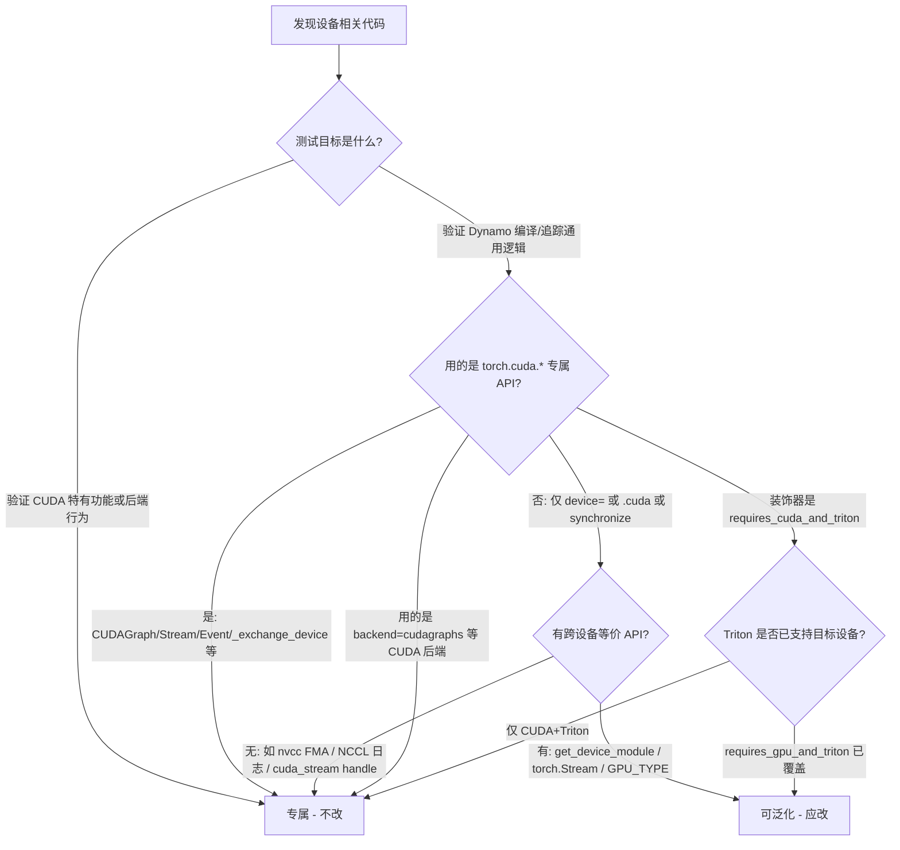

# Dynamo 测试用例硬件耦合解耦改造指南

本文档面向 `test/dynamo/` 下测试用例的硬件耦合问题，沿用 [code-plan.md](code-plan.md) 中的解耦思路，并结合社区参考提交 `85f319fa`（DTensor 测试中引入 `skip_if_lt_x_devices` 与 `torch.accelerator` 动态设备推导）给出逐文件改造建议。

**适用范围**：本文档覆盖以下 67 个 Dynamo 测试文件（截至 2026-07-02 代码库扫描结果）。

```
test_activation_checkpointing.py    test_activation_offloading.py
test_after_aot.py                   test_aot_autograd_cache.py
test_aot_autograd.py                test_aot_compile.py
test_autograd_function.py           test_backends.py
test_backward_higher_order_ops.py     test_base_hop.py
test_base_output.py                 test_buffers_override.py
test_bytecode_debugger.py           test_bytecode_utils.py
test_callback.py                    test_check_type_id.py
test_compile.py                     test_compiler_bisector.py
test_comprehensions.py              test_comptime.py
test_config.py                      test_contains_protocol.py
test_ctx_manager.py                 test_cudagraphs_expandable_segments.py
test_cudagraphs.py                  test_debug_utils.py
test_decorators.py                  test_deque_reconstruct.py
test_deviceguard.py                 test_dicts.py
test_dynamic_shapes.py              test_dynamic_spec.py
test_dynamo_decompositions.py       test_dynamo_ops.py
test_dynamo_profiler.py             test_einops.py
test_enum.py                        test_error_messages.py
test_exceptions.py                  test_exc.py
test_exitstack.py                   test_export_mutations.py
test_export.py                      test_fake_distributed.py
test_flat_apply.py                  test_frame_init.py
test_functions.py                   test_fwd_loss_bwd.py
test_fx_annotate.py                 test_fx_graph_runnable.py
test_fx_passes_pre_grad.py          test_generator.py
test_getitem.py                     test_global.py
test_graph_deduplication.py           test_graph_region_tracker.py
test_guard_exclusion.py             test_guard_manager.py
test_guard_serialization.py
```

**参考文档**：[code-plan.md](code-plan.md)（FSDP 解耦指南，三类耦合分类法）

**参考提交**：`85f319fa` — Refactor device checks in distributed tensor tests to use `skip_if_lt_x_devices`

---

## 1. Dynamo 与 FSDP 解耦的差异

| 维度 | FSDP / 分布式测试 | Dynamo 单进程测试 |
|------|-------------------|-------------------|
| 主要耦合类型 | 类型一（多卡 skip）+ 类型二/三 | **类型二/三为主** |
| `skip_if_lt_x_gpu` | 广泛使用 | **67 个文件中零使用** |
| 推荐参数化方式 | `skip_if_lt_x_devices` + `device_type` 模块变量 | `instantiate_device_type_tests` 注入 `device` 参数 |
| 多卡 world_size | `MultiProcessTestCase` | 基本不涉及 |

**结论**：Dynamo 测试**不需要**引入 `skip_if_lt_x_devices`（该装饰器面向分布式多进程测试）。改造重点是将硬编码 `cuda` 替换为动态 `device_type` / `GPU_TYPE`，同时保留 CUDA 专属 API 测试不动。

---

## 2. 解耦分类法（沿用 code-plan.md）

### 类型一：多设备 skip 装饰器

- **FSDP 做法**：`skip_if_lt_x_gpu` → `skip_if_lt_x_devices`（见 `85f319fa`）
- **Dynamo 结论**：**不适用**。Dynamo 测试均为单进程单元测试，无多卡 world_size 需求。

### 类型二：设备特定 API / 专用测试

#### 小类 1：可泛化的设备 API（应改造）

判断标准：将 `device="cuda"`、`torch.cuda.synchronize()` 等替换为基于 `device_type` 的调用后，语义仍成立。

推荐做法：

```python
device_type = acc.type if (acc := torch.accelerator.current_accelerator()) else "cpu"

# 替换规则
device="cuda"           -> device=device_type
.cuda()                 -> .to(device_type)
torch.cuda.synchronize() -> torch.get_device_module(device_type).synchronize()
torch.cuda.current_device() -> torch.get_device_module(device_type).current_device()
@unittest.skipIf(not TEST_CUDA, ...) -> @unittest.skipIf(not torch.accelerator.is_available(), ...)
```

已有工具：

- `torch.accelerator.current_accelerator()` — 获取当前加速器
- `torch.get_device_module(device_type)` — 设备无关 API 入口
- `GPU_TYPE`（`torch.testing._internal.inductor_utils`）— Inductor/Dynamo 测试常用 GPU 设备名
- `instantiate_device_type_tests` — 框架级 `device` 参数注入（**首选**）

#### 小类 2：CUDA / 后端专属逻辑（保持不动）

判断标准：测试的**核心断言对象**是某套仅存在于特定硬件/软件栈上的机制，换设备后要么无法运行，要么测的不再是同一件事。

推荐做法：**完全不做改动**，与社区 PR #184593 的 left unchanged 策略一致。

> 详细判断方法、信号表、逐文件拆解见 **[第 3 节](#3-cudagpu-专属判断指南详细)**。

### 类型三：模型 / Tensor 显式设备名硬编码

- `.cuda()` → `.to(device_type)`
- `device="cuda"` → `device=device_type` 或 `device` 参数（来自 `instantiate_device_type_tests`）
- 真正 CPU-only 语义（如 CPU offload 测试中的 `.to("cpu")`）保留 `"cpu"` 字符串

---

## 3. CUDA/GPU 专属判断指南（详细）

本节回答一个实操问题：**看到测试里出现 `cuda` / `gpu`，怎么判断该不该改？**

核心原则只有一句：

> **不是在测「能在 GPU 上跑」，而是在测「CUDA 这套特有机制本身」→ 专属，不改。  
> 只是在 GPU 上跑普通计算，碰巧写了 `device="cuda"` → 可泛化，应改。**

---

### 3.0 决策流程图

对测试方法中的每一段设备相关代码，按顺序问：



**三步快判口诀**：

1. **看 API 名字**：`torch.cuda.CUDAGraph` → 专属；`torch.randn(..., device=xxx)` → 可能只是硬编码。
2. **看测试名/docstring**：`test_cuda_stream_*`、`test_cudagraph_*` → 专属；`test_basic_compile` 里写了 `device="cuda"` → 可泛化。
3. **看有没有「泛化版兄弟测试」**：同文件若已有 `instantiate_device_type_tests` 的 `test_* (self, device)`，旧版 `test_cuda_*` 往往测的是**遗留 API 的 Dynamo 追踪**，保留不动。

---

### 3.1 信号表：出现什么代码 = 大概率专属

| 信号（代码特征） | 为何专属 | Dynamo 文件实例 |
|------------------|----------|-----------------|
| `torch.cuda.CUDAGraph()` / `torch.cuda.graph()` | PyTorch 尚无跨设备 Graph 抽象 | `test_cudagraphs.py` L247–248 |
| `backend="cudagraphs"` | Inductor cudagraph 后端当前绑定 CUDA | `test_cudagraphs.py` 全文件 |
| `TEST_CUDA_GRAPH` / `PYTORCH_TEST_SKIP_CUDAGRAPH` | 环境 flag 专用于 CUDA Graph 能力 | `test_cudagraphs.py` L202 |
| `torch.cuda.Stream()` / `torch.cuda.Event()` / `torch.cuda.stream()` | **遗留** CUDA 命名空间 API；Dynamo 对它们的追踪路径与 `torch.Stream(device=...)` 不同 | `test_ctx_manager.py` `CUDACtxManagerTests` 类 |
| `torch.cuda._exchange_device` | CUDA C++ 层设备切换，无通用封装 | `test_ctx_manager.py` L2431 |
| `torch.cuda.device(idx)` 上下文管理器 | CUDA 专属 device 上下文 | `test_ctx_manager.py` L2417 |
| `torch.cuda.default_generators[i]` | CUDA RNG 状态序列化格式 | `test_after_aot.py` L285–316 |
| golden string 含 `'cuda'` 且断言 repro 输出格式 | 测的是 dump 文本格式，不是计算 | `test_after_aot.py` `reader.generator('cuda', 0)` |
| `torch.cuda.memory._set_allocator_settings("expandable_segments:...")` | CUDA 分配器私有配置 | `test_cudagraphs_expandable_segments.py` |
| docstring 写 nvcc / FMA / non-bitwise | 断言的是 **CUDA 编译器融合行为**，换设备语义变了 | `test_dynamo_decompositions.py` L846–872 |
| `torch.backends.cudnn` + `torch.version.cuda` 分支 | 断言 cudnn vs flash attention 选择逻辑 | `test_activation_checkpointing.py` L1976–1986 |
| `torch.ops.aten._scaled_dot_product_cudnn_attention` | CUDA/cuDNN 融合算子 | 同上 |
| `@requires_cuda_and_triton` | 装饰器定义里写死 `HAS_CUDA_AND_TRITON` | `test_activation_checkpointing.py` 大量 Triton 测试 |
| `stream=torch.cuda.current_stream().cuda_stream` | 传 CUDA driver 原始 stream handle 给 autotuner | `test_aot_autograd_cache.py` L4055 |
| `TORCH_BISECT_SUBSYSTEM=cudagraphs` | bisect 子系统名绑定 cudagraph | `test_compiler_bisector.py` `test_cudagraph_bisect_max` |
| `@requires_cuda`（`common_utils`） | 等价于 `torch.cuda.is_available()`，且测试体调用 `torch.cuda.*` 专属函数 | `test_compiler_bisector.py` cudagraph 用例 |
| `torch.cuda.manual_seed` / `torch.cuda.random.*` | 测的是 **CUDA 命名空间下** RNG builtin 的 Dynamo 追踪 | `test_functions.py` `test_cuda_manual_seed` |
| `torch.cuda.get_device_properties` + 断言 `major`/`multi_processor_count` | 断言 CUDA 设备属性字段 | `test_functions.py` `test_get_device_properties_tensor_device` |
| `@onlyCUDA` / `@skipCUDAIf` | 框架装饰器，显式标记 CUDA-only | `test_ctx_manager.py` L2971+ |
| `torch.cuda.is_bf16_supported()` | CUDA 能力查询（部分已可用 `torch.accelerator` 替代，但此处与 CUDA autocast 路径绑定） | `test_ctx_manager.py` `CUDACtxManagerTests` 内 |

---

### 3.2 信号表：出现什么代码 = 大概率可泛化（应改）

| 信号 | 替换方式 | 说明 |
|------|----------|------|
| `device="cuda"` 且逻辑是 `randn`/`Linear`/普通 op | `device=device_type` 或 `device=GPU_TYPE` | **最常见误判**：写了 cuda 不等于测 cuda |
| `.cuda()` | `.to(device_type)` | 同上 |
| `@unittest.skipIf(not TEST_CUDA)` 且测试体无 `torch.cuda.*` 专属调用 | `torch.accelerator.is_available()` | 仅需要「有加速器」 |
| `torch.cuda.synchronize()` | `torch.get_device_module(device_type).synchronize()` | `get_device_module` 已支持多后端 |
| `torch.cuda.current_device()` | `torch.get_device_module(device_type).current_device()` | 同上 |
| `torch.cuda.memory_stats()` | `torch.get_device_module(device_type).memory_stats()` | 若目标设备支持；不支持则 runtime `skipTest` |
| `CudaInterface` 硬编码 | `get_interface_for_device(device_type)` | `test_deviceguard.py` |
| 类名 `TestCUDADeviceGuard` 但只测 `DeviceGuard` 协议 | 改为 `TestAcceleratorDeviceGuard` | 与 Interface 实现无关 |
| `torch.Stream(device=device)` + `torch.accelerator.current_stream()` | **已经泛化** | `test_ctx_manager.py` `CtxManagerTestsDevice` |
| `instantiate_device_type_tests` 注入的 `device` 参数 | **已经泛化** | 无需再改 |

---

### 3.3 七类「专属」机制详解（附代码）

#### 类别 A：CUDA Graph / cudagraph 后端

**判断**：测试目标是「图捕获/重放」或 Inductor `cudagraphs` 后端，而非普通 `torch.compile`。

```python
# test/dynamo/test_cudagraphs.py — 专属，全文件不改
@unittest.skipIf(not torch.cuda.is_available(), "these tests require cuda")
class TestAotCudagraphs(...):
    @torch.compile(backend="cudagraphs")   # ← 后端名即绑定 CUDA
    def fn(x, y): ...

    g = torch.cuda.CUDAGraph()             # ← 无 torch.accelerator.graph()
    with torch.cuda.graph(g): ...
```

**为何不能改成 `device_type`**：`backend="cudagraphs"` 和 `CUDAGraph` 是 CUDA 运行时概念；改成 `device=xpu` 后测试的是完全不同的代码路径，等于换了一个测试。

**区分**：`test_compiler_bisector.py` 里大部分用例已用 `GPU_TYPE`，**只有** `test_cudagraph_bisect_max`（`@requires_cuda` + `TORCH_BISECT_SUBSYSTEM=cudagraphs`）是专属。

---

#### 类别 B：遗留 `torch.cuda.Stream/Event` API 的 Dynamo 追踪

**判断**：测试的是 Dynamo 能否正确追踪 **`torch.cuda.Stream()`** 这类旧 API，而非「任意设备上的 stream」。

同文件对比（`test_ctx_manager.py`）：

```python
# 专属：CUDACtxManagerTests（L2056+）— 测遗留 API
class CUDACtxManagerTests(...):
    def test_cuda_stream_context_manager1(self):
        s = torch.cuda.Stream()                    # ← torch.cuda 命名空间
        current_stream = torch.cuda.current_stream()
        with torch.cuda.stream(s): ...

# 已泛化：CtxManagerTestsDevice（L2611+）— 测新 API
class CtxManagerTestsDevice(...):
    def test_stream_context_manager1(self, device):
        s = torch.Stream(device=device)            # ← 设备无关
        current_stream = torch.accelerator.current_stream()
        with s: ...
```

**结论**：`CUDACtxManagerTests` 整个类保持不动；`CtxManagerTestsDevice` 已通过 `instantiate_device_type_tests` 覆盖新硬件。**不是漏改，是故意保留两条追踪路径。**

---

#### 类别 C：CUDA 编译器 / 数值行为差异（nvcc FMA）

**判断**：docstring 或注释说明「非 bitwise」「nvcc 融合」，断言的是 **CUDA 编译产物** 的行为。

```python
# test/dynamo/test_dynamo_decompositions.py L846 — 专属
@unittest.skipUnless(torch.cuda.is_available(), "requires CUDA")
def test_addcdiv_scalar_value_cuda(self, device):
    """...
    Not bitwise: ATen inlines the division into fma(alpha, t1/t2, input)
    which nvcc can optimize differently than separate div + fma kernels.
    """
```

**为何专属**：方法名带 `_cuda`，且正确性依赖 nvcc 的 FMA 融合。在 XPU/CPU 上即使用 `device=xpu`，数值对比的参照系也变了。

**区分**：同文件其他 `def test_*(self, device)` 用 `instantiate_device_type_tests` 且 docstring 无 nvcc 说明 → 已泛化。

---

#### 类别 D：Triton kernel + `@requires_cuda_and_triton`

**判断**：装饰器定义即限定了 CUDA：

```python
# torch/testing/_internal/triton_utils.py
requires_cuda_and_triton = unittest.skipUnless(
    HAS_CUDA_AND_TRITON, "requires cuda and triton"   # ← 写死 CUDA
)
# HAS_CUDA_AND_TRITON = torch.cuda.is_available() and HAS_TRITON
```

`test_activation_checkpointing.py` 中约 30+ 个 `@requires_cuda_and_triton` 测试调用 Inductor/Triton 生成的 kernel，当前 Triton 路径以 CUDA 为主。

**何时可改**：若测试改用 `@requires_gpu_and_triton`（接受 CUDA 或 XPU + Triton），且 kernel 在 XPU 上可跑，才可泛化。这需要单独评估，**不能只做字符串替换**。

---

#### 类别 E：CUDA 生态绑定（cuDNN SDPA、设备属性、RNG）

**判断**：断言内容引用 CUDA 特有字段或算子。

```python
# test_activation_checkpointing.py L1976 — 专属
dprops = torch.cuda.get_device_properties(device)
prefer_cudnn = (cudnn_version > 91500 and dprops.major in (9, 10) ...)
if prefer_cudnn and torch.version.cuda:
    sdpa_op = torch.ops.aten._scaled_dot_product_cudnn_attention.default
else:
    sdpa_op = torch.ops.aten._scaled_dot_product_flash_attention.default
```

```python
# test_functions.py L1398 — 专属
def test_get_device_properties_tensor_device(a):
    prop = torch.cuda.get_device_properties(x.device)
    if prop.major == 8:   # ← 断言 CUDA compute capability
        return x + prop.multi_processor_count
```

```python
# test_functions.py L3609 — 专属
def test_cuda_manual_seed(self):
    seed_fns = (torch.cuda.manual_seed, torch.cuda.manual_seed_all, ...)
    # ← 测的是 Dynamo 对 torch.cuda.manual_seed 这个 builtin 的追踪
```

**区分**：`test_functions.py` 里 `test_tensor_type2` 用 `device_type` + `HAS_GPU` → 已泛化，与上面三个是不同测试。

---

#### 类别 F：Repro / dump 格式绑定设备名字符串

**判断**：`assertExpectedInline` 或 `assertIn` 检查**生成文本**中含 `'cuda'`。

```python
# test_after_aot.py L283 — 专属
def test_dump_generator(self):
    gen = torch.cuda.default_generators[0].clone_state()
    writer.generator("fwd_rng_state_0", gen)
    self.assertExpectedInline(..., """reader.generator('cuda', 0)  # fwd_rng_state_0""")
```

泛化需要改 **repro 工具输出格式**（`InputWriter`），不是改测试里一个字符串。在工具未支持 `reader.generator(device_type, idx)` 前，测试保持 CUDA-only。

---

#### 类别 G：驱动级 handle / 分配器私有 API

```python
# test_aot_autograd_cache.py L4055 — 专属
autotuner.run(..., stream=torch.cuda.current_stream().cuda_stream)
#                                    ^^^^^^^^^^^^^^^^^^^^^^^^^^^^^^
#                                    CUDA driver 原始 stream 指针

# test_cudagraphs_expandable_segments.py — 专属
torch.cuda.memory._set_allocator_settings("expandable_segments:True")
#            ^^^^^^^^^^^^^^^^^^^^^^^^^^^^
#            CUDA caching allocator 私有接口
```

**判断**：参数类型是 C 层 handle（`.cuda_stream`），或函数在 `torch.cuda.memory` 下且带 `_` 前缀 → 专属。

---

### 3.4 灰色地带：容易误判的场景

| 场景 | 看起来像专属 | 实际判断 | 建议 |
|------|-------------|----------|------|
| `device="cuda"` 出现在普通 matmul/compile 测试 | 是 | **可泛化** | 改 `GPU_TYPE` / `device_type` |
| 整个类 `@skipIf(not torch.cuda.is_available())` | 是 | 看类体内 API；仅 skip 装饰器专属 | 装饰器可改，API 另判 |
| `test_cudagraphs.py` 里 `device="cuda"` | 是 | 文件整体专属 | 连 `device=` 也不改，避免 partial 改动 |
| `torch.cuda.memory_stats()` | 是 | **可能可泛化** | XPU 等若支持 `memory_stats` 则可改；CUDA Graph 文件里则不改 |
| `@requires_cuda_and_triton` | 是 | Triton 测试 | 保留，除非迁到 `requires_gpu_and_triton` |
| `test_ctx_manager.py` 同时有两套 stream 测试 | 混乱 | CUDA 类专属 + Device 类已泛化 | 只动 `CtxManagerTestsDevice` 如有遗漏 |
| `GPU_TYPE` 变量 | 像硬编码 | **已是动态值** | `inductor_utils.GPU_TYPE` 在 CUDA 上为 `"cuda"`，XPU 上为 `"xpu"` |
| `HAS_GPU` / `HAS_CUDA_AND_TRITON` | 像耦合 | 测试基础设施 | 用 `HAS_GPU` 判断「有无 GPU」比手写 `torch.cuda` 更好 |

---

### 3.5 文件级专属清单（展开版）

| 文件 | 专属范围 | 判断依据摘要 | 已泛化的兄弟测试 |
|------|----------|--------------|------------------|
| `test_cudagraphs.py` | **全文件** | `backend="cudagraphs"` + `CUDAGraph` + `TEST_CUDA_GRAPH` | 无（Owner: `module: cuda graphs`） |
| `test_cudagraphs_expandable_segments.py` | **全文件** | `_set_allocator_settings` | 无 |
| `test_ctx_manager.py` | `CUDACtxManagerTests` 类（L2056–~2608） | `torch.cuda.Stream/Event/stream/device/_exchange_device` | `CtxManagerTestsDevice` + `instantiate_device_type_tests` |
| `test_after_aot.py` | `test_dump_generator`、`test_graphsafe_rng_repro` | CUDA generator repro 文本格式 | 同文件其他测试已用 `instantiate_device_type_tests` |
| `test_dynamo_decompositions.py` | `test_addcdiv_*_cuda`（2 个） | nvcc FMA docstring | `TestDynamoDecompositionsNumerics` 其余方法 |
| `test_compiler_bisector.py` | `test_cudagraph_bisect_max`（1 个） | `@requires_cuda` + cudagraph bisect | 同文件其余用 `GPU_TYPE` |
| `test_functions.py` | `test_get_device_properties_tensor_device`、`test_cuda_manual_seed` | `torch.cuda.*` 专属 builtin/属性 | 大量 `device_type` / `HAS_GPU` 测试 |
| `test_activation_checkpointing.py` | 所有 `@requires_cuda_and_triton`；L1976 SDPA 测试；**不含** L2432 memory budget | Triton / cuDNN 路径 | `ActivationCheckpointingViaTagsTests` 已 `except_for="cpu"` |
| `test_aot_autograd_cache.py` | L4055 附近 autotuner stream handle 测试 | `.cuda_stream` 原始指针 | 同文件大量 `@parametrize("device", GPU_TYPE)` |

---

### 3.6 自检清单（改之前过一遍）

对准备修改的测试方法，**全部回答「否」** 才动手改：

- [ ] 方法名或类名是否含 `cuda` / `cudagraph` / `nccl`？
- [ ] 是否使用 `torch.cuda.` 下 **Stream / Event / Graph / graph / _exchange_device / default_generators**？
- [ ] 是否使用 `backend="cudagraphs"` 或 `TEST_CUDA_GRAPH`？
- [ ] docstring 是否提到 nvcc / FMA / non-bitwise / cudnn？
- [ ] 是否断言 repro 日志/golden string 中的 `'cuda'` 字面量？
- [ ] 装饰器是否是 `@requires_cuda_and_triton` 或 `@requires_cuda` 且方法体调用 `torch.cuda.*`？
- [ ] 同文件是否已有参数化版本测同一逻辑？（有则旧 CUDA 版不改）

若仅第 7 项为「是」且其余为「否」→ **放心改**。

---

## 4. 文件分类总览

### 4.1 无硬件耦合（42 个）— 无需改动

| 文件 | 说明 |
|------|------|
| `test_activation_offloading.py` | 无设备相关模式 |
| `test_aot_compile.py` | 无设备相关模式 |
| `test_backward_higher_order_ops.py` | 无设备相关模式 |
| `test_base_hop.py` | 无设备相关模式 |
| `test_base_output.py` | 无设备相关模式 |
| `test_buffers_override.py` | 无设备相关模式 |
| `test_bytecode_debugger.py` | 无设备相关模式 |
| `test_bytecode_utils.py` | 无设备相关模式 |
| `test_check_type_id.py` | 无设备相关模式 |
| `test_compile.py` | 无设备相关模式 |
| `test_comprehensions.py` | 无设备相关模式 |
| `test_comptime.py` | 无设备相关模式 |
| `test_config.py` | 无设备相关模式 |
| `test_contains_protocol.py` | 无设备相关模式 |
| `test_decorators.py` | 无设备相关模式 |
| `test_deque_reconstruct.py` | 无设备相关模式 |
| `test_dicts.py` | 无设备相关模式 |
| `test_dynamic_shapes.py` | 无设备相关模式 |
| `test_dynamic_spec.py` | 无设备相关模式 |
| `test_dynamo_profiler.py` | 无设备相关模式 |
| `test_einops.py` | 无设备相关模式 |
| `test_enum.py` | 无设备相关模式 |
| `test_exceptions.py` | 无设备相关模式 |
| `test_exc.py` | 无设备相关模式 |
| `test_exitstack.py` | 无设备相关模式 |
| `test_export_mutations.py` | 无设备相关模式 |
| `test_fake_distributed.py` | 无设备相关模式 |
| `test_flat_apply.py` | 无设备相关模式 |
| `test_frame_init.py` | 无设备相关模式 |
| `test_fwd_loss_bwd.py` | 无设备相关模式 |
| `test_fx_graph_runnable.py` | 无设备相关模式 |
| `test_fx_passes_pre_grad.py` | 无设备相关模式 |
| `test_generator.py` | 无设备相关模式 |
| `test_global.py` | 无设备相关模式 |
| `test_graph_deduplication.py` | 无设备相关模式 |
| `test_graph_region_tracker.py` | 无设备相关模式 |
| `test_guard_exclusion.py` | 无设备相关模式 |
| `test_guard_serialization.py` | 无设备相关模式 |

### 4.2 已通过框架参数化（8 个）— 基本达标

| 文件 | 现状 | 处理 |
|------|------|------|
| `test_backends.py` | `instantiate_device_type_tests` | 保持 |
| `test_dynamo_ops.py` | 同上 | 保持 |
| `test_export.py` | 同上，`except_for="cpu"` | 保持 |
| `test_debug_utils.py` | 多处 `instantiate_device_type_tests` | 保持 |
| `test_fx_annotate.py` | 参数化 + `@skipCUDAIf` | 保持 |
| `test_guard_manager.py` | `torch.accelerator.current_accelerator()` | 保持 |
| `test_autograd_function.py` | 模块级 `device_type` | 保持 |
| `test_callback.py` | 模块级 `device_type` | 保持 |

### 4.3 CUDA 专属逻辑 — 保持不动（详见第 3 节）

| 文件 | 专属范围 | 一句话原因 |
|------|----------|------------|
| `test_cudagraphs.py` | 全文件 | cudagraph 后端 + `CUDAGraph` |
| `test_cudagraphs_expandable_segments.py` | 全文件 | CUDA 分配器私有配置 |
| `test_ctx_manager.py` | `CUDACtxManagerTests` 类 | 遗留 `torch.cuda.Stream` 追踪；已有 `CtxManagerTestsDevice` 泛化版 |
| `test_after_aot.py` | 2 个 generator repro 测试 | repro 输出格式含 `'cuda'` |
| `test_dynamo_decompositions.py` | 2 个 `*_cuda` 方法 | nvcc FMA 数值行为 |
| `test_compiler_bisector.py` | `test_cudagraph_bisect_max` | cudagraph bisect 子系统 |
| `test_functions.py` | 2 个方法 | `torch.cuda.get_device_properties` / `manual_seed` 追踪 |
| `test_activation_checkpointing.py` | `@requires_cuda_and_triton` + SDPA 测试 | Triton / cuDNN 路径 |
| `test_aot_autograd_cache.py` | autotuner `.cuda_stream` 测试 | CUDA driver handle |

### 4.4 需要改造（7 个）— 按优先级排列

| 优先级 | 文件 | 预估改动量 | 改造类型 |
|--------|------|------------|----------|
| P1 | `test_deviceguard.py` | ~15 行 | 类型二小类 1 |
| P1 | `test_getitem.py` | 2 行 | 类型三 |
| P1 | `test_error_messages.py` | 3 行 | 类型二/三 |
| P1 | `test_aot_autograd.py` | 6 行 | 类型三 |
| P2 | `test_aot_autograd_cache.py` | ~20 处 | 类型二/三 |
| P2 | `test_activation_checkpointing.py` | ~30 行 | 类型二/三（仅 memory budget 测试） |
| P3 | `test_compiler_bisector.py` | 0（已用 `GPU_TYPE`） | 仅 `test_cudagraph_bisect_max` 保持 CUDA-only |

---

## 5. 逐文件改造方案

### 5.1 `test_deviceguard.py`（P1）

**现状**：

- `TestDeviceGuard`：Mock `DeviceInterface`，无硬件依赖 — **不改**
- `TestCUDADeviceGuard`：硬编码 `TEST_CUDA`、`CudaInterface`、`torch.cuda.current_device()`

**改造方案**：将 `TestCUDADeviceGuard` 泛化为 `TestAcceleratorDeviceGuard`，通过 `get_interface_for_device` 获取当前加速器的 Interface。

原有代码：

```python
from torch.testing._internal.common_cuda import TEST_CUDA

@unittest.skipIf(not TEST_CUDA, "No CUDA available.")
class TestCUDADeviceGuard(torch._dynamo.test_case.TestCase):
    def setUp(self):
        super().setUp()
        self.device_interface = CudaInterface

    def test_device_guard_no_index(self):
        current_device = torch.cuda.current_device()
        device_guard = DeviceGuard(self.device_interface, None)
        ...
```

修改后：

```python
from torch._dynamo.device_interface import DeviceGuard, get_interface_for_device

device_type = acc.type if (acc := torch.accelerator.current_accelerator()) else None

@unittest.skipIf(device_type is None, "requires accelerator")
class TestAcceleratorDeviceGuard(torch._dynamo.test_case.TestCase):
    def setUp(self):
        super().setUp()
        self.device_interface = get_interface_for_device(device_type)
        self.device_mod = torch.get_device_module(device_type)

    def test_device_guard_no_index(self):
        current_device = self.device_mod.current_device()
        device_guard = DeviceGuard(self.device_interface, None)
        with device_guard as _:
            self.assertEqual(self.device_mod.current_device(), current_device)
            self.assertEqual(device_guard.prev_idx, -1)
            self.assertEqual(device_guard.idx, None)
        ...
```

---

### 5.2 `test_getitem.py`（P1）

**位置**：L775–788，`test_triton_kernel_getitem_grid`

**问题**：已有 `HAS_GPU and HAS_CUDA_AND_TRITON` skip，但 tensor 仍硬编码 `device="cuda"`。

```python
# 改前
x = torch.randn(256, device="cuda")
y = torch.randn(256, device="cuda")

# 改后
from torch.testing._internal.inductor_utils import GPU_TYPE
x = torch.randn(256, device=GPU_TYPE)
y = torch.randn(256, device=GPU_TYPE)
```

---

### 5.3 `test_error_messages.py`（P1）

**位置**：L896 附近

```python
# 改前
@unittest.skipIf(not torch.cuda.is_available(), "requires cuda")
def test_...(self):
    linear = torch.nn.Linear(10, 20, device="cuda").eval()

# 改后（对齐 85f319fa 中 requires_cuda 的替换方式）
@unittest.skipIf(not torch.accelerator.is_available(), "requires accelerator")
def test_...(self):
    device_type = torch.accelerator.current_accelerator().type
    linear = torch.nn.Linear(10, 20, device=device_type).eval()
```

---

### 5.4 `test_aot_autograd.py`（P1）

**位置**：L1820+，2 个测试方法

```python
# 改前
@unittest.skipIf(not torch.cuda.is_available(), "requires cuda")
def test_...(self):
    x = torch.randn(20, 16, requires_grad=True, device="cuda")
    ...

# 改后
device_type = acc.type if (acc := torch.accelerator.current_accelerator()) else "cpu"

@unittest.skipIf(not torch.accelerator.is_available(), "requires accelerator")
def test_...(self):
    x = torch.randn(20, 16, requires_grad=True, device=device_type)
    ...
```

---

### 5.5 `test_aot_autograd_cache.py`（P2）

文件已大量使用 `GPU_TYPE` 和 `@parametrize("device", ...)`，仅需清理零星硬编码：

| 位置 | 改前 | 改后 |
|------|------|------|
| L989, L1045, L2064–2065 | `device="cuda"` | `device=GPU_TYPE` |
| L772, L2110, L2212 | `not torch.cuda.is_available()` | `not torch.accelerator.is_available()`（通用加速器测试） |
| L3452 | `"cuda" if torch.cuda.is_available() else "cpu"` | `GPU_TYPE if HAS_GPU else "cpu"` |
| L4055 | `torch.cuda.current_stream().cuda_stream` | **保留**（CUDA autotuner 专属） |

---

### 5.6 `test_activation_checkpointing.py`（P2，局部）

**不改区域**：

- `ActivationCheckpointingViaTagsTests` + `instantiate_device_type_tests(..., except_for="cpu")` — 已参数化
- 所有 `@requires_cuda_and_triton` 测试 — Triton 绑定 CUDA
- L1976 SDPA 后端优先级测试 — CUDA cudnn/flash 选择逻辑

**改造区域**：L2432–2537，`test_region_activation_memory_budget_*`（2 个方法）

```python
# 文件顶部（若尚未存在）
device_type = acc.type if (acc := torch.accelerator.current_accelerator()) else "cpu"

# 改前
@unittest.skipIf(not torch.cuda.is_available(), "requires CUDA")
def test_region_activation_memory_budget_reduces_act_mem(self):
    def get_act_mem(f):
        start_mem = torch.cuda.memory_stats()["requested_bytes.all.current"]
        ...
    x = torch.randn(N, N, device="cuda")
    compiled = torch.compile(Model().cuda(), backend="aot_eager")

# 改后
@unittest.skipIf(not torch.accelerator.is_available(), "requires accelerator")
def test_region_activation_memory_budget_reduces_act_mem(self):
    device_mod = torch.get_device_module(device_type)

    def get_act_mem(f):
        start_mem = device_mod.memory_stats()["requested_bytes.all.current"]
        ...
    x = torch.randn(N, N, device=device_type)
    compiled = torch.compile(Model().to(device_type), backend="aot_eager")
```

> 注意：若目标加速器不支持 `memory_stats()`，测试应在运行时 `self.skipTest(...)` graceful skip。

---

## 6. 改造优先级与执行顺序

```
P0  无需改动（42 个无耦合文件 + 10 个 CUDA 专属文件/方法）
 |
P1  小改（4 个文件，各 2–15 行）
 |    test_deviceguard.py
 |    test_getitem.py
 |    test_error_messages.py
 |    test_aot_autograd.py
 |
P2  中改（2 个文件）
 |    test_aot_autograd_cache.py
 |    test_activation_checkpointing.py（仅 memory budget 段）
 |
完成
```

**建议执行策略**：

1. 先完成 P1 四个文件，改动小、风险低，可快速验证新硬件（如 XPU）能否跑通。
2. P2 在 P1 验证通过后分批提交，避免与 Triton/CUDA 专属测试混淆。
3. 每个 PR 附带 Test Plan，在目标加速器环境运行改动文件：

```bash
python test/dynamo/test_deviceguard.py
python test/dynamo/test_getitem.py -k test_triton_kernel_getitem_grid
python test/dynamo/test_error_messages.py
python test/dynamo/test_aot_autograd.py
python test/dynamo/test_aot_autograd_cache.py
python test/dynamo/test_activation_checkpointing.py -k test_region_activation_memory_budget
```

---

## 7. 与参考提交 85f319fa 的对照

| 85f319fa 做法 | Dynamo 等价做法 |
|---------------|-----------------|
| `skip_if_lt_x_gpu` → `skip_if_lt_x_devices` | **不适用**（Dynamo 无多卡测试） |
| `@requires_cuda` → `torch.accelerator.is_available()` | 用于 `test_error_messages`、`test_deviceguard` 等 |
| `self.device_type = "cuda"` → `current_accelerator().type` | 模块级 `device_type` 或测试方法内动态获取 |
| golden string 中 `'cuda'` → `f'{device_type}'` | 若 `assertExpectedInline` 含设备名，参考 `test_dtensor_logging.py` |
| 新增 `skip_if_lt_x_devices` 到 `common_distributed.py` | Dynamo **不需要**此基础设施 |

---

## 8. 社区 PR 参考

| PR |  relevance | 参考方法 |
|----|-----------|----------|
| `85f319fa`（本地） | DTensor 设备检查解耦 | `skip_if_lt_x_devices` + `torch.accelerator` |
| #184593 (`test_autograd.py`) | 通用设备 API 参数化 | `torch.accelerator.*` / `get_device_module`；CUDA 专属保留 |
| #176717 (`test_unary_ufuncs.py`) | `@onlyAccelerator` 装饰器 | 跳过 CPU/meta 的通用加速器判断 |
| #184261 (`test_serialization.py`) | `device="cuda"` 参数化 | tensor 创建时统一用 `device` 参数 |
| #184315 (`test_functional.py`) | `.cuda()` 替换 | `.to(device)` |
| #184192 (`test_lazy_modules.py`) | 删除 `if TEST_CUDA: device = "cuda"` | 框架注入 `device` 参数 |

---

## 9. 统计摘要

| 分类 | 文件数 | 占比 |
|------|--------|------|
| 无硬件耦合，无需改动 | 42 | 62.7% |
| 已参数化，基本达标 | 8 | 11.9% |
| CUDA 专属，保持不动 | 10（部分方法） | 14.9% |
| 需要实际改造 | 7 | 10.4% |

**核心原则**（与 code-plan.md 一致）：

- 能泛化的：`torch.accelerator` / `get_device_module` / `GPU_TYPE` / `instantiate_device_type_tests`
- 不能泛化的：CUDA Graph、CUDA Stream/Event、Triton、NCCL、nvcc FMA — **left unchanged**
